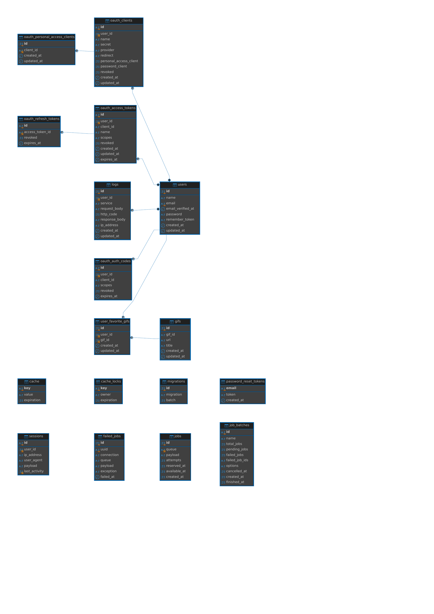

# Prex Challenge - Laravel API + Giphy API

sail artisan route:list

Personal access client not found. Please create one.
sail artisan passport:client --personal

sail artisan test

# Giphy API

## Descripción

Este proyecto es una API REST que se integra con la API de Giphy y proporciona servicios de autenticación y búsqueda de GIFs.

## Requisitos

- PHP 8.2
- Laravel 10
- MariaDB o MySQL
- Docker

## Instalación

1. Clonar el repositorio.
2. Ejecutar `composer install`
3. Configurar el archivo `.env`.
4. Levantar proyecto `./vendor/bin/sail up`
5. Correr migraciones, `./vendor/bin/sail artisan migrate`.
6. Ejecutar `./vendor/bin/sail artisan passport:client --personal `.

## Endpoints
- `Post/api/registger`: Alta de usuario.
- `POST /api/login`: Autenticación.
- `GET /api/gifs/search`: Buscar GIFs.
- `GET /api/gifs/{id}`: Buscar GIF por ID.
- `POST /api/{id}/favorite`: Guardar GIF favorito.

## Tests

Ejecutar `./vendor/bin/sail artisan test` para correr los tests.

## Colección POSTMAN

Importar la colección POSTMAN desde el archivo `docs/prex-challenge.postman_collection.json`.

## DER

## Pendiente
- Diagrama de Casos de Uso.
- Diagrama de Secuencia.
- Implementar Request personalizados en endpoints para validar la entrada.
- Implementar test automatizados en todas las operativas.
- Implementar CI/CD
- Mejorar la gestión de los access_tokens generados.

